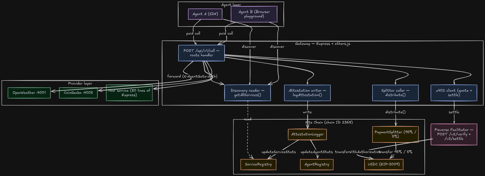
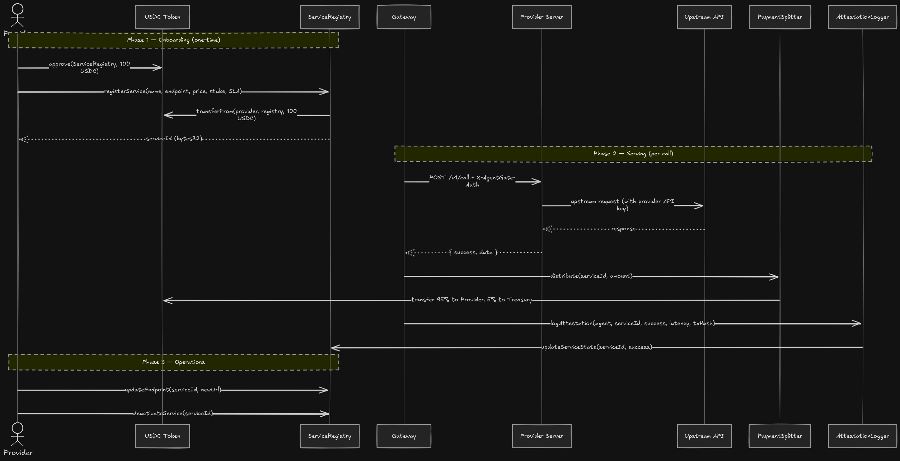

# AgentGate

> An on-chain marketplace where AI agents pay USDC for legacy APIs via **x402**,
> and where independent providers resell that infrastructure with reputation
> staked on-chain.

AgentGate is a two-sided marketplace for AI agents and API infrastructure providers. Agents discover providers on-chain by reputation, price, or latency, and pay per call in USDC — no API keys, no signups, no subscriptions. Providers stake USDC to publish their services, earn 95% of every call, and accumulate on-chain reputation that compounds over time. The gateway sits between them as a thin router that handles x402 settlement, request forwarding, and attestation logging — it holds no API keys and no funds in flight.

Deployed on **Kite Chain testnet (chain ID 2368)**, settled via the **Pieverse x402 facilitator**, paid in **USDC** (`transferWithAuthorization` / EIP-3009).

**Live demo:** [agent-gate.vercel.app](https://agent-gate-b414jnz67-antriksh-gwal-s-projects.vercel.app)

---

## Index

- [Quick start](#quick-start)
- [Agent Flow](#agent-flow)
- [Provider Flow](#provider-flow)
- [How to be a provider](#how-to-be-a-provider)
- [Architecture Diagram](#architecture-diagram)
- [Demo and examples](#demo-and-examples)
- [Why this isn't just "yet another x402 demo"](#why-this-isnt-just-yet-another-x402-demo)
- [Running tests](#running-tests)
- [Smart contracts](#smart-contracts)
- [x402 details](#x402-details)
- [Repository layout](#repository-layout)
- [Adding a new provider](#adding-a-new-provider)
- [Deployment notes](#deployment-notes)
- [AgentGate V2 roadmap](#agentgate-v2-roadmap)
- [Acknowledgements](#acknowledgements)

---

## Quick start(Running locally)

### Prerequisites

- Node 20+, `pnpm`
- Foundry (`forge`, `cast`)
- A Kite Chain testnet wallet funded with KITE for gas ([faucet](https://faucet.gokite.ai))

### Install and run

```bash
git clone https://github.com/Antrikshgwal/Agent-gate.git
cd Agent-gate
cp .env.example .env   # fill in keys + addresses (or use the testnet defaults)

make install           # installs every workspace
make demo              # boots gateway + 3 providers + frontend in one terminal
```

`make demo` starts (with prefixed logs):

| Process | Port |
| --- | --- |
| gateway | `:3000` |
| OpenWeather primary | `:4001` |
| OpenWeather budget | `:4002` |
| CoinGecko | `:4003` |
| frontend | `:3001` |

Visit [http://localhost:3001](http://localhost:3001) and click around. Ctrl+C kills the whole group.

### Make your first paid call

```bash
cd sdk && npx tsx examples/weather.ts
```

You'll get JSON weather data plus three tx hashes (`payment.transaction`, `distribution_tx_hash`, `attestation_tx_hash`) — all settled on Kite testnet.

---

## Agent Flow

An agent that wants to call a paid API doesn't sign up, doesn't hold an API key, and doesn't pre-fund anything. It discovers a provider on-chain, pays per call in USDC via x402, and the call returns with cryptographic proof of payment.



Every successful call increments the agent's reputation score and the provider's `successfulCalls`; every failure increments `failedCalls`. Reputation is computed live on-chain:

```
reputation = 700 · successRate + 200 · ageBonus + 100 · volumeBonus
```

---

## Provider Flow

A provider is anyone who owns a Kite Chain wallet, has an upstream API they want to resell, and is willing to stake 100 USDC for credibility. The flow is symmetric to the agent flow — you publish, you serve, you get paid.




The provider's server is the only place the upstream API key lives. The gateway speaks one shared wire format (`POST /v1/call`) to every provider — adding a new upstream is roughly 80 lines of Express.

---

## How to be a provider

Three steps. Total time: under 10 minutes once you have a wallet funded.

**1. Fork the template.**

```bash
cp -r providers/template providers/my-service
cd providers/my-service
```

Edit `src/server.ts`: set `SERVICE_NAME`, list the methods you support in `SUPPORTED_METHODS`, and call your upstream API from the dispatcher. Set `AGENTGATE_GATEWAY_SECRET` and any upstream API keys via env vars.

**2. Deploy your server.**

Any Node host works — Railway, Render, Fly.io, your own box. The gateway just needs an HTTPS URL it can `POST /v1/call` to.

**3. Register on-chain.**

Open [/register](https://agent-gate-b414jnz67-antriksh-gwal-s-projects.vercel.app/register), connect your provider wallet, fill in name + endpoint + price + stake. Submit. The gateway starts routing the moment `registerService` is mined.

You can also call `registerService` directly via `cast` — the UI is a convenience, not a gate.

---

## Architecture Diagram


The gateway is intentionally thin: it does not hold API keys, does not custody funds, and does not arbitrate disputes. Everything material — discovery, payment, reputation — lives in the four contracts on the right.

---

## Demo and examples

### Live, hosted

| Surface | URL |
| --- | --- |
| Frontend | [agent-gate.vercel.app](https://agent-gate-b414jnz67-antriksh-gwal-s-projects.vercel.app) |
| Gateway API | [gateway-production-1f1c.up.railway.app](https://gateway-production-1f1c.up.railway.app/health) |
| Block explorer | [testnet.kitescan.ai](https://testnet.kitescan.ai) |

### In the frontend

- **`/`** — landing with live ticker of recent paid calls
- **`/services`** — every registered provider with price, uptime, stake, and which one `findProvider` would pick under each strategy
- **`/services/[id]`** — single-provider detail with success/failure mix
- **`/playground`** — fire a paid call as a demo agent and watch the 5-step pipeline run live (`discover → quote → sign → settle → attest`)
- **`/agents`** — agent launchpad with JSON-LD discovery feed
- **`/agents/[did]`** — single-agent dashboard: reputation breakdown + attestation history
- **`/register`** — provider registration form (wallet-connected)
- **`⌘K`** — command palette with quick presets (Weather in London / Tokyo, BTC + ETH price)

### Via the SDK

```ts
import { AgentGateClient, findProvider } from "@agentgate/sdk";

const svc = await findProvider({ name: "OpenWeather", strategy: "best_reputation" });
const client = new AgentGateClient({ privateKey, gatewayUrl });

const res = await client.call(svc.id, "get_current_weather", { city: "London" });
console.log(res.data, res.payment.transaction);
```

---

## Why this isn't just "yet another x402 demo"

Most x402 examples are a single server gating one endpoint. AgentGate adds the three pieces that make a **marketplace**:

1. **On-chain discovery + reputation.** `ServiceRegistry` is a real directory.
   Every successful or failed call updates `totalCalls / successfulCalls` for
   the provider and `reputationScore` for the agent. The SDK ships a
   `findProvider({ name, strategy })` helper so agents pick by `cheapest`,
   `best_reputation`, or `first_match` — and the `/services` page mirrors
   that exact logic so you can see which one wins at a glance.

2. **Payment splitting in a contract, not in the gateway.** `payTo` on the
   402 quote is the `PaymentSplitter`. The gateway settles **into** the
   splitter, then calls `distribute(serviceId, amount)`, which reads the
   provider out of `ServiceRegistry` and fans out 95% / 5%. No off-chain
   bookkeeping, no gateway holding funds in flight.

3. **Provider HTTP contract that any operator can implement in ~80 lines.**
   `POST /v1/call` with `{ method, params }`, `X-AgentGate-Auth` shared
   secret, returns `{ success, data, error }`. The gateway speaks one wire
   format to every provider; the gateway code does not change when you add
   a new upstream API.

---

## Running tests

### Solidity (Foundry)

```bash
cd contracts
forge test -vv
```

Coverage is heaviest on `PaymentSplitter` (rounding, drain-to-zero invariants) and `AttestationLogger` (only-owner gates, double-attestation prevention).

### TypeScript

```bash
make typecheck   # runs tsc --noEmit across gateway, sdk, frontend, providers
```

There are no JS unit tests — the SDK is exercised end-to-end by `make seed` and `make demo`, which hit live testnet contracts.

---

## Smart contracts

All four are pure-Solidity, no upgradability, no proxies. Foundry tests live in `contracts/test/`.

### `ServiceRegistry`

- `registerService(name, endpoint, schemaHash, pricePerCall, stake, SLA)` — pulls USDC stake via `transferFrom`. `MIN_STAKE = 100 USDC`.
- `updateEndpoint(id, newEndpoint)` — provider-only, lets ops rotate the backend without re-staking.
- `getAllServices()` — frontend / SDK discovery feed.
- `updateServiceStats(id, success)` — only callable by `AttestationLogger`.

### `AgentRegistry`

- `registerAgent(did)` — DID is a `bytes32` derived from the agent's Kite Passport identity. Starts at neutral reputation (500/1000).
- Reputation = 700·successRate + 200·age + 100·volume, recomputed on every attestation.

### `AttestationLogger`

- The only contract the gateway needs `onlyOwner` access to. Each call writes a single attestation and updates both registries.
- This is what makes reputation tamper-evident: the gateway can't fake a successful call, only log what actually happened.

### `PaymentSplitter`

- `distribute(serviceId, amount)` — gateway-owned; reads the provider out of `ServiceRegistry`, transfers 95% to them and 5% to the protocol treasury. Rounding favors the protocol so the splitter is always drained to zero per call (verified in `PaymentSplitter.t.sol`).
- `sweep()` — owner-only escape hatch for residual dust.

### Live testnet addresses (chain ID 2368)

| Contract | Address |
| --- | --- |
| `ServiceRegistry` | `0xF1b879E314e05ED8d6381AaF30793f2B204C39B2` |
| `AgentRegistry` | `0x29527d55D2Fe6d777378920581A9cc2F76eEe6ba` |
| `AttestationLogger` | `0xBf8319a66b4079D07f1230a7222882b6218c565b` |
| `PaymentSplitter` | `0x77C268964E38CeB6b654D36eB4aBedE82B615f4b` |
| `USDC (MockUSDC)` | `0x0309764915AFC7a2a7CDd1E64c58a57c1F1705E3` |
| Gateway wallet | `0xe5A044f3d61D2381bded585AC357be9d9e8aD564` |

---

## x402 details

We implement x402 **v2** against Pieverse (`https://facilitator.pieverse.io`).

- Network is CAIP-2: `eip155:2368` (Pieverse's expected format).
- Quote envelope shape: `{ x402Version, paymentPayload: { x402Version, payload, accepted }, paymentRequirements }` — `accepted` mirrors `paymentRequirements`. The shape was reverse-engineered from Pieverse's Python lib; both `gateway/src/x402/` and `sdk/src/` agree on it.
- Asset is the deployed MockUSDC. EIP-3009 `transferWithAuthorization` is signed by the agent and submitted by Pieverse — the gateway never holds the agent's signature beyond settlement.
- `payTo` on every 402 quote is the **PaymentSplitter address**, not the gateway. The gateway has no claim on funds in flight.

---

## Repository layout

```
agent-gate/
├── contracts/                  Foundry workspace
│   ├── src/                    ServiceRegistry, AgentRegistry, AttestationLogger, PaymentSplitter
│   ├── test/                   forge tests (10+ for splitter alone)
│   ├── script/Deploy.s.sol     deploys all four with correct wiring
│   └── deployments/2368.json   addresses for Kite testnet
├── gateway/                    Express + ethers.js
│   ├── src/routes/call.ts      402 → settle → forward → split → attest
│   ├── src/blockchain/         on-chain reads + write helpers
│   └── src/x402/facilitator.ts Pieverse client
├── providers/
│   ├── template/               60-line forkable skeleton
│   ├── openweather/            reference provider (paid upstream)
│   ├── coingecko/              reference provider (free upstream)
│   └── README.md               gateway↔provider RPC contract
├── sdk/                        TypeScript client
│   ├── src/client.ts           AgentGateClient.call (x402 round-trip)
│   ├── src/discovery.ts        findProvider({ name, strategy })
│   ├── src/sign.ts             EIP-3009 signing helpers
│   └── examples/weather.ts     end-to-end demo call
├── frontend/                   Next.js 14 App Router
│   ├── app/page.tsx            landing
│   ├── app/services/           browse + strategy-aware selection UI
│   ├── app/playground/         live demo agent runner
│   ├── app/register/           on-chain provider registration form
│   ├── app/agents/[did]/       agent dashboards
│   └── lib/discovery.ts        mirrors sdk/src/discovery.ts exactly
├── Makefile                    install / build / typecheck / demo / seed
├── DEPLOY.md                   Vercel + Railway deployment runbook
└── .env                        single source of truth for addresses + keys
```

---

## Adding a new provider

This is the path you'd take in production. The gateway code does not change.

```bash
cp -r providers/template providers/my-service
cd providers/my-service
# 1. Edit src/server.ts: rename SERVICE_NAME, add methods to the dispatcher,
#    call your upstream API.
# 2. Set MY_UPSTREAM_API_KEY-style env vars + AGENTGATE_GATEWAY_SECRET.
pnpm install && pnpm dev
# 3. Deploy publicly (Railway, Render, Fly — any Node host).
# 4. Go to /register, connect provider wallet, fill in
#    name / endpoint / pricePerCall / stake / SLA. Submit.
```

The gateway starts routing the moment `registerService` is mined.

---

## Deployment notes

Full step-by-step runbook in [`DEPLOY.md`](./DEPLOY.md). Short version:

| Component | Host | Notes |
| --- | --- | --- |
| Frontend (Next.js) | Vercel | `vercel --prod` from `frontend/`. All `NEXT_PUBLIC_*` vars must be set before build (Next.js inlines them at compile time). |
| Gateway + 3 providers | Railway | One project, four services. Each service has its own root directory. Use `railway up <path> --path-as-root --service <name>` since Railpack analyzes from the upload root. |
| Contracts | Kite Chain testnet | `forge script script/Deploy.s.sol --broadcast`. Addresses land in `contracts/deployments/2368.json`. |

A few hard-learned gotchas:

- **Next.js + `process.env`**. Dynamic property access (`process.env[name]`) does *not* get inlined by the Next.js compiler — only literal property access (`process.env.NEXT_PUBLIC_FOO`) does. The frontend's `lib/env.ts` is structured around this.
- **`useSearchParams` in App Router** needs a Suspense boundary or the production build will fail at the prerender step.
- **Railway monorepo deploys** ignore `source.rootDirectory` when you use `railway up` from the linked project root. Either `cd` into the sub-app first or pass `--path-as-root`.
- **Provider endpoints are on-chain.** If you redeploy a provider to a new URL, the provider wallet must call `ServiceRegistry.updateEndpoint(id, newUrl)` — the gateway reads endpoints live from chain, not from config.

---

## AgentGate V2 roadmap

The current build is a working v1. The next slice tightens trust and broadens what the marketplace can support:

- **Per-provider rotating secrets** fetched from a KMS at gateway startup, replacing the shared `AGENTGATE_GATEWAY_SECRET`.
- **SLA oracle + automatic slashing.** `ServiceRegistry.slashStake` is implemented but gated on owner; v2 wires it to an off-chain SLA monitor that watches latency + uptime and slashes on threshold breach.
- **Agent passport integration.** Today `AGENT_DID` is configured manually; v2 reads it from the local Kite Passport CLI daemon via the agent's passkey.
- **Real USDC on mainnet.** MockUSDC is a stand-in because Kite testnet doesn't ship a 6-decimal USDC. Production swap is a one-line `.env` change once the canonical address ships.
- **Subscription / streaming payments.** x402 is per-call; some upstreams (LLM streaming, video) want per-second metering. Either x402.5 or a sidecar payment channel.
- **Provider operator-vs-treasury split.** Splitter owner is currently the gateway wallet; v2 separates "who runs the gateway" from "who owns the 5% protocol fee."

---

## Acknowledgements

- **Kite AI** for the chain + Passport SDK
- **Pieverse** for the x402 v2 facilitator (and for shipping the Python reference that let us reverse-engineer the envelope shape)
- **OpenZeppelin** for the contract primitives
- **shadcn / Tailwind / Next.js** for the frontend stack
- **Railway + Vercel** for the hosting
